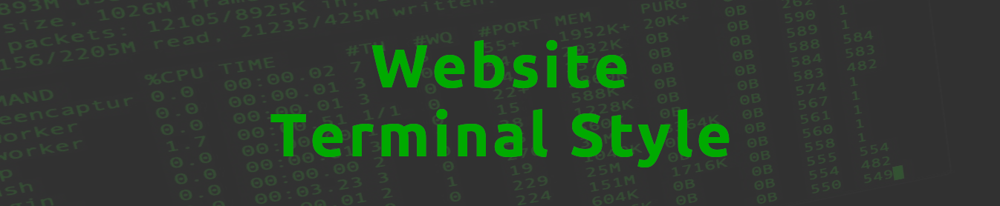

# Projeto: WebSite Terminal Style

Usando HTML, CSS e Javascript para cosntruir um website estilo terminal bash. 

## Tecnologias

* HTML5
* CSS3
* JavaScript
* Biblioteca - winbox.bundle

## Instrutor(a)

Canal: [Traversy Media](https://www.youtube.com/c/TraversyMedia)

## Autor
Edson souza

[Linkedin](https://www.linkedin.com/in/edsonfrs/)

[GitHub](https://github.com/Edsonfrs)

